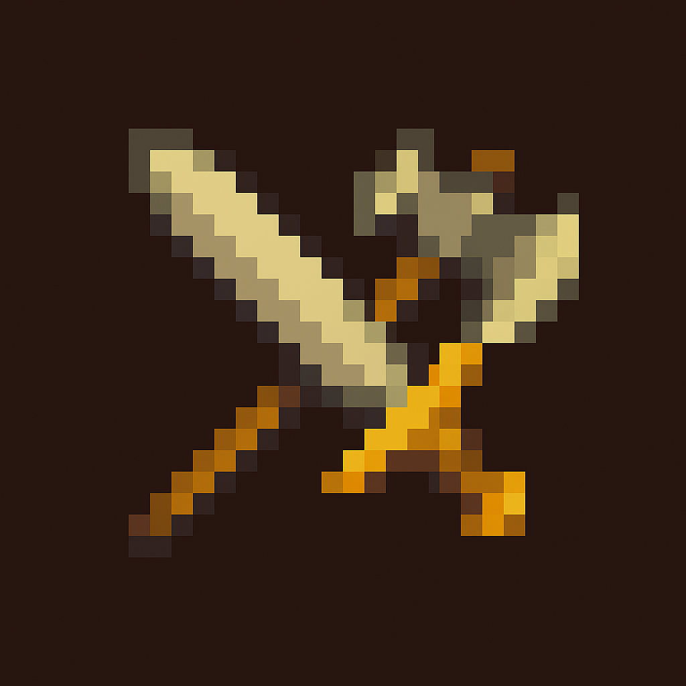

# Adventurer's Guild 

**Adventurer's Guild** is a retro-styled, singleplayer browser RPG inspired by classic pixel games. Built using HTML, CSS, and JavaScript, the game immerses players in a fantasy world where they explore, loot, fight enemies, and build their character through stats and gear.

## Current Features

### Core Gameplay

- Travel between locations with unique ASCII and pixel art.
- Loot items from the environment.
- Fight dynamically generated enemies.
- Equip weapons and armor in designated slots.
- Tooltip system for item inspection.
- Modal-based player stats, inventory, and gear menus.
- Basic combat UI including enemy display and attack logic.
- Interactive context menu on inventory items (right-click-style actions).
- Fixed retro-style layout with theming and stylized backgrounds per location type (e.g., forest, ruins).

### UI and Styling

- Custom pixel art theme with `Press Start 2P` font.
- Fog overlay and animated backgrounds.
- Sidebars for player info and travel destinations.
- Dev console for debugging or cheat commands.
- Inventory and equipment system rendered in modal with hover tooltips.
- Save and load progress via browser storage.

### Modular Code Structure

- `game.html` for in-game UI and logic.
- `index.html` for main menu with start/load/credits.
- `styles.css` and `game.css` for layered retro theming.
- Data-driven design for items (`items.js`), locations (`location.js`), enemies (`enemy.js`), and player (`player.js`).

## Future Goals

### 1. **Combat System Enhancements** 

- Add combat animations.
- Implement status effects (e.g., poison, stun).
- Support multiple enemy types and wave-based battles.
- Add dodge/block mechanics using Dexterity and Constitution.

### 2. **Inventory Improvements**

- Drag-and-drop item rearrangement.
- Sort/filter inventory options.
- Add item rarity colors and gear comparisons.

### 3. **Character Progression**

- Experience and level-up system with stat increases.
- Skill trees or ability unlocks.
- Multiple hero classes with unique traits.

### 4. **World Expansion**

- More detailed locations with branching travel paths.
- Location-based events and random encounters.
- Quests and objectives tied to locations.

### 5. **UI/UX Additions**

- ~~Save/load system using browser storage.~~ Implemented!
- Music and sound effects toggle in settings.
- Visual transitions between locations.

### 6. **Lore and Immersion**

- Add journals, scrolls, or NPC dialogues.
- World map visualization in the right sidebar.
- Quest log modal with completion tracking.

### 7. **Performance and Architecture**

- Refactor for better modularity and event delegation.
- Add utility methods for deep-copying item data.
- Optimization for mobile support.

---

## Getting Started

Clone the repo and open `index.html` in your browser to start the game.

```bash
git clone https://github.com/DaBurgermeista/Caford_Chronicles-.git
cd Caford_Chronicles-
